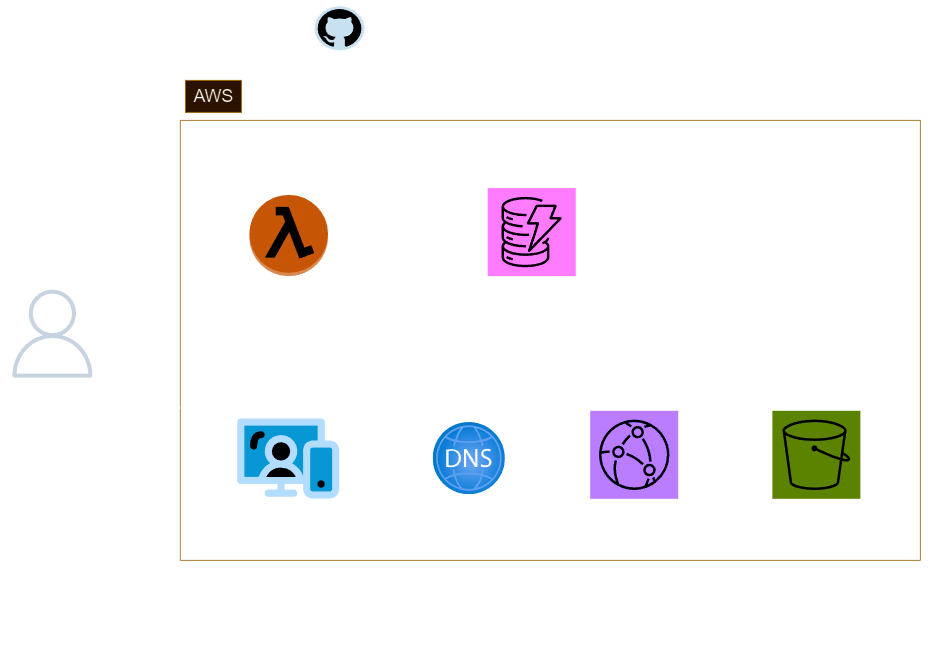

# AWS Cloud Resume Challenge
This is my version of the AWS Cloud Resume Challenge. What is the Cloud Resume Challenge? The Cloud Resume Challenge is a hands-on project designed to help you build and demonstrate your expertise by incorporating many of the skills that real cloud and DevOps engineers use in their daily work.

## Architecture
Below is a diagram detailing the architecture I have utilised in this project:

Tech-stack:
- S3
- AWS CloudFront
- Certificate Manager
- AWS Lambda, Python
- DynamoDB, Java
- Terraform, HCL, JSON
- Github Actions, YML
- HTML, CSS, JavaScript

## Links for Cloud Resume Challenge
- My cloud resume challenge: https://www.toddblakeman.co.uk/
- The original cloud resume challenge: https://cloudresumechallenge.dev/docs/the-challenge/aws/
